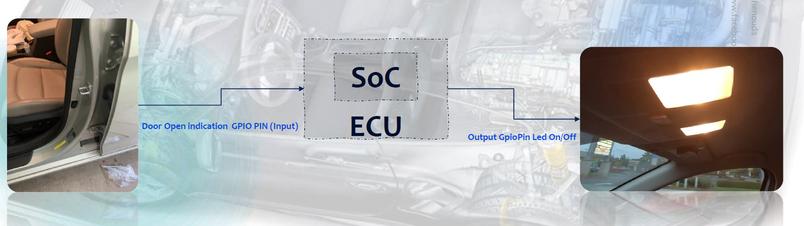
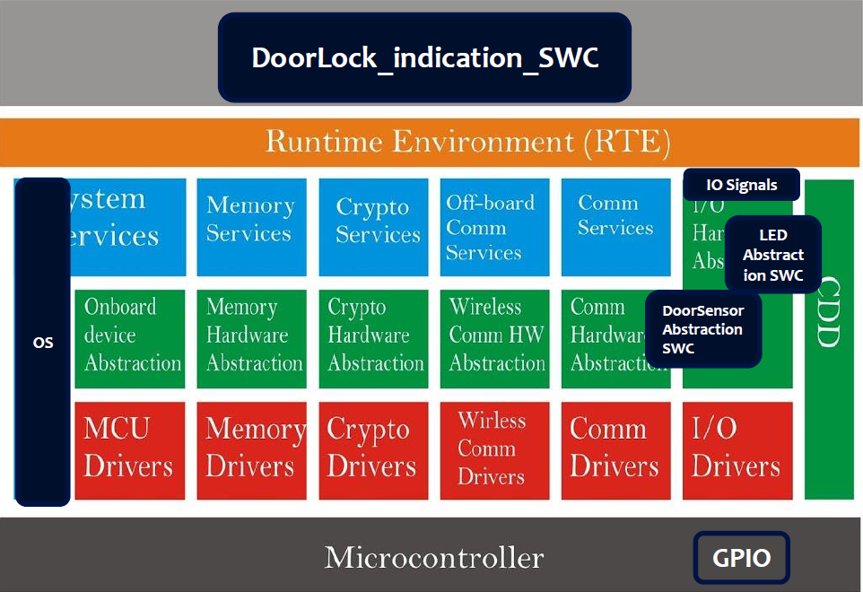
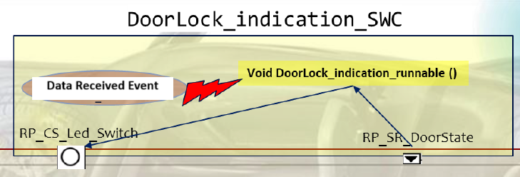
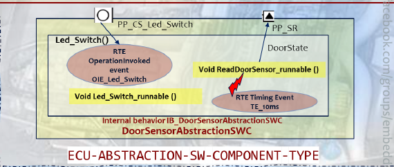
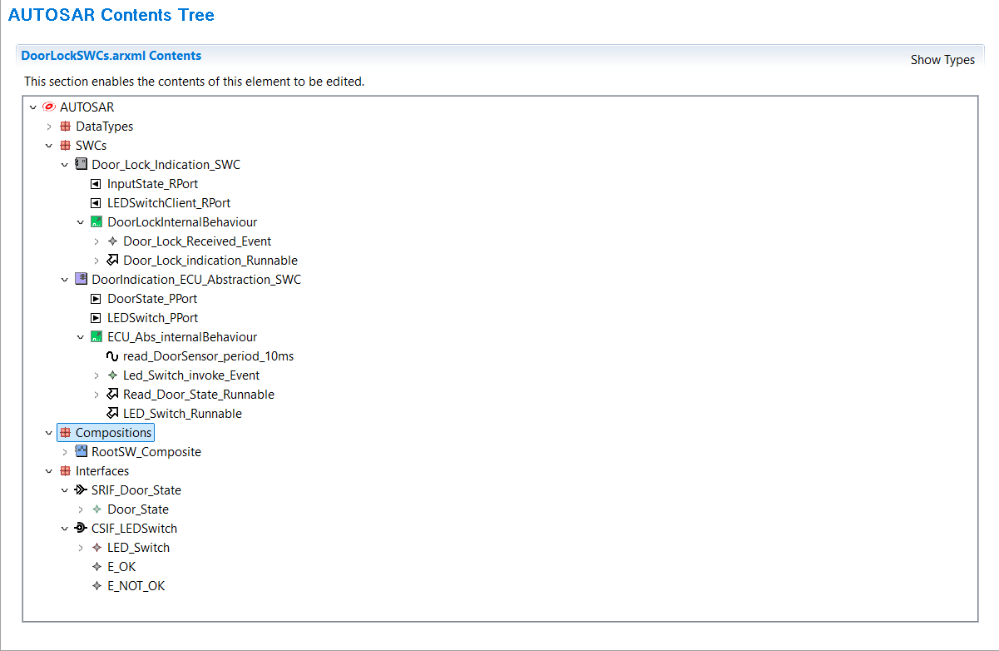
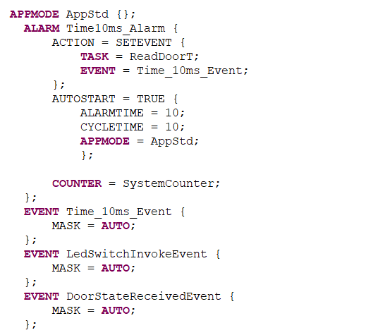
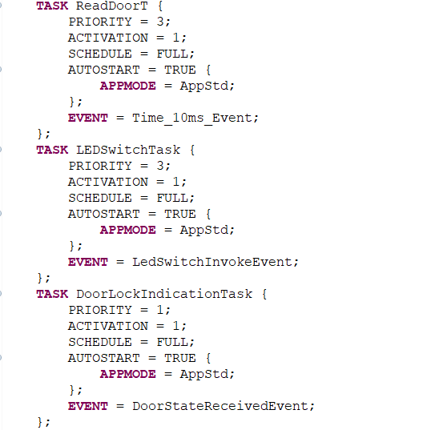
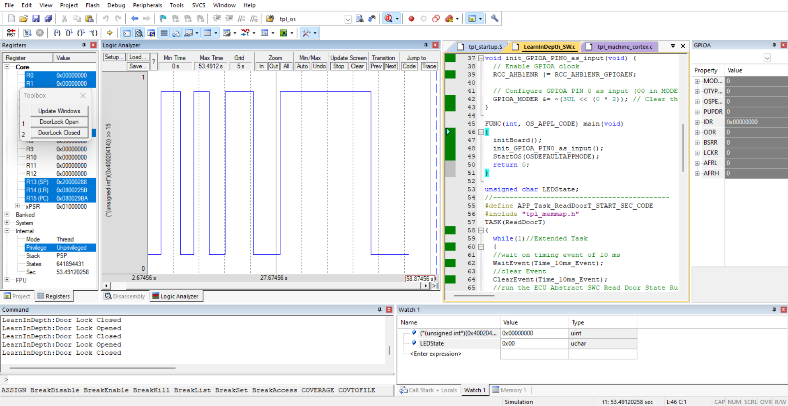

## DOOR Lock Indicator AUTOSAR Project
# project overview

AUTOSAR project that gets Door Lock Status and Accordingly taking Action to LED.

# AUTOSAR Layers:
this project targets the SWAL (applicaion layer) , RTE, I/O stack and OS module in Service Layer.

# Application Layer:
contains Door Lock Indication Application Software component which is responsible for :
1. Read the Door State through Requester port of Sender-Receiver Interface type.
2. Call the service responsible for taking action to the Led according to the Door lock State.

# I/O Stack (IO Abstraction)
contains Door Sensor ECU abstration software Component which is responsible for:
1. communicate to MCAL to Read the Door Lock sensor Through GPIO.
2. Apply the Led Action to the LED through GPIO.

** implemented all SWCs and its elements ,runnable,Events with Arxml based on AUTOSAR schema 4.0.2 using ARTOP **

# OS module based on Trampoline OS based on OSEK/VDX standard:
contains the mapping of Rte Events and Tasks to run the SWCs runnables :
- RTE events mapping to OS events:
    1. Timing event of 10 ms which triggers read door sensor Runnable -> Time_10ms_event which is set by alarm.
    2. DataReceivedEvent triggers the doorLockindication runnable in App SWC to read the door state -> DoorStateReceivedEvent
    3. OpertionInvokedEvent to run the server runnable when the client call it -> LEDSwitchInvokeEvent 

 

# results:
project run on STM32F407VG and test on Keil

# project is part of the tasks of Learn in Depth AUTOSAR Diploma with Eng.Keroles Shenouda